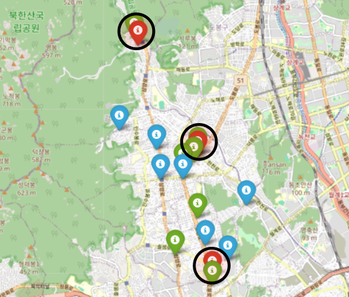

# 스타벅스 vs 이디야: 근접 입점 전략 분석

## 주제

이디야가 스타벅스 매장 근처에 전략적으로 입점한다는 논란이 있는데, **사실일까?**

## 분석 방법

### **가설**
   - 스타벅스 매장이 많은 곳에 이디야 매장도 많을 것
   - 인구가 많은 서울시의 스타벅스 매장과 이디야 매장 분포 비교 필요

### **방법**
   - 각 매장의 주소 확보 (스타벅스/이디야 홈페이지)
   - 위도 & 경도 확보 (Google Place API)
   - 거리 계산:
      - `geopy.distance` 라이브러리 활용
      - 스타벅스 매장을 중심으로 **반경 250m(보도 3분 거리)** 기준으로 근처 이디야 매장 판별

  

## 데이터 수집

| 데이터 종류 | 수집 대상 | 수집 출처 | 수집 도구 |
| :--- | :--- | :--- | :--- |
| **매장명, 주소, 위도, 경도** | 스타벅스 | 공식 홈페이지 | Selenium, BeautifulSoup |
| **매장명, 주소** | 이디야 | 공식 홈페이지 | Selenium, BeautifulSoup |
| **위도, 경도** | 이디야 | Google | Google Place API |

### 수집된 데이터
- **스타벅스**: 634건
- **이디야**: 517건 (위도/경도 null 1건 제외)

## 분석 결과

### 매장 분포

- 서울시 전체 분포 시각화

  

  

- **스타벅스 매장 분포 상위 구:**
  - 강남구, 중구, 서초구, 영등포구, 종로구

- **이디야 매장 분포 상위 구:**
  - 영등포구, 강남구, 서초구, 종로구, 중구

  

### 상관관계 분석

- 구별 스타벅스 수 vs 이디야 수 **상관계수 r = 0.672**
- 강하지는 않지만 상관관계 존재:
   - 스타벅스 매장이 많은 곳에 이디야 매장도 많을 가능성
   - 그러나 상권이 발달하거나 유동인구가 많아 카페가 많을 가능성도 있음

  

### 지도 확인

  

<table align="center">
  <tr>
    <td align="center"> <b>도봉구</b></td>
    <td align="center"> <b>강북구</b></td>
  </tr>
</table>

(스타벅스 매장에 근접한 이디야 매장은 빨간색 마커로 표시)
- 도봉구, 강북구의 사례에서 일부 의심스러운 사례가 발견됨

### 근접 거리 분석

- 분석 대상: 스타벅스 매장 634개
- 반경 250m 내 이디야 매장이 1개 이상 존재하는 스타벅스 매장:
   - **267개 (42.1%)**

  

- 스타벅스 매장이 적은 구(관악구, 동작구, 중랑구, 강북구, 도봉구)에서도 근접 비율:
   - 28% ~ 57% 수준

  

### 핵심 발견사항

   - 42.1%의 스타벅스 매장 근처에 이디야 매장 존재
   - 평균 근접 거리: 180m
   - 가장 가까운 사례: 15m

## 결론

이디야 매장 중 일부가 스타벅스 매장 근처에 위치하고 있기는 하지만, 전체 이디야 매장 수에 비하면 그 비율은 절반 이하(42.1%)로 낮은 편임.

또한, 입점 시기를 고려하지 않았으므로 42.1% 내에는 스타벅스 매장보다 이디야 매장이 먼저 입점한 경우를 포함할 수 있음.

따라서,
> **"이디야가 전략적으로 스타벅스 매장 근처에 입점한다"고 일반화하기는 어려움**

## 참고 자료

프로젝트 발표 자료: [Google Slides](https://docs.google.com/presentation/d/1xFlIYq5XX1r92-U_-H6hxWLiBIiOgZRc/edit?usp=drive_link&ouid=110925745350713448729&rtpof=true&sd=true)
